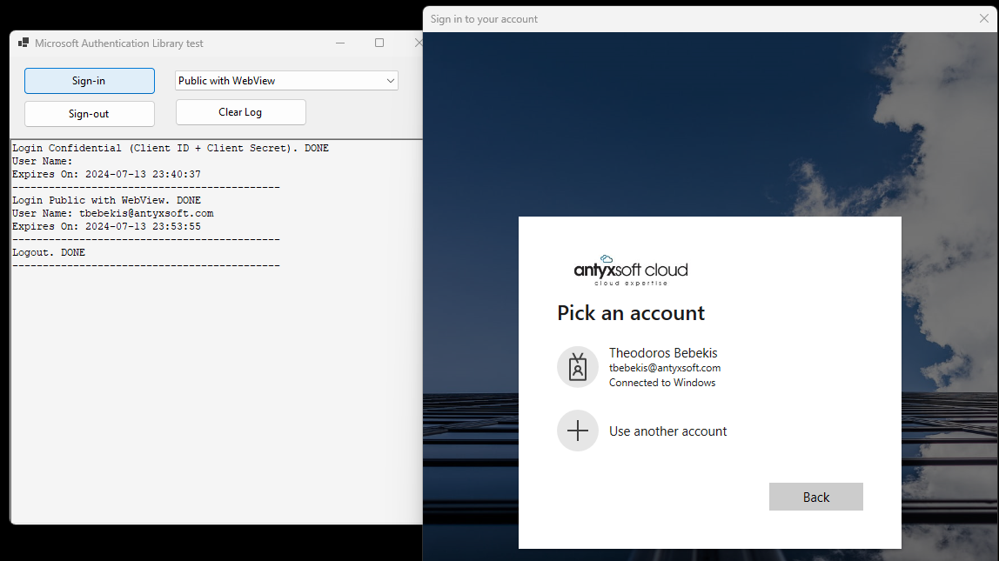
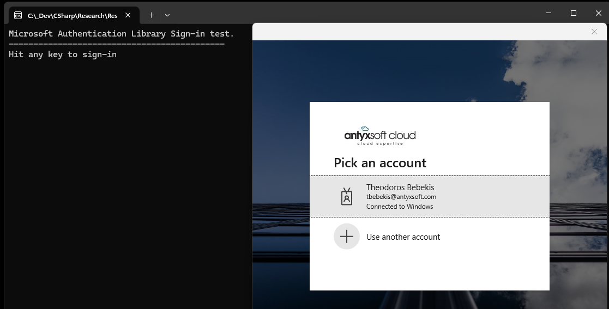

# Microsoft Authentication Library for .NET

[**Microsoft Authentication Library for .NET (MSAL.Net)**](https://learn.microsoft.com/en-us/entra/msal/dotnet/) is a .Net Library that enables applications to provide authentication operations using [Microsoft Entra ID](https://en.wikipedia.org/wiki/Microsoft_Entra_ID).

This text explains what MSAL is and how to use it in .Net applications along with source code and demo applications.





## Microsoft Entra ID

The **Azure Active Directory** is now named [Microsoft Entra ID](https://en.wikipedia.org/wiki/Microsoft_Entra_ID).

**Microsoft Entra ID** is an [Identity Provider](https://en.wikipedia.org/wiki/Identity_provider) and [Access Management service](https://en.wikipedia.org/wiki/Identity_management) cloud-based service.

**Microsoft Entra ID** provides authentication and authorization services to 
- Microsoft Azure
- Microsoft 365
- Dynamics 365
- other Microsoft services and solutions
- and third-party services.

## Microsoft Authentication Library for .NET (MSAL.Net)

An application uses the MSAL.Net to aquire an [Access Token](https://en.wikipedia.org/wiki/Access_token) from Microsoft Entra ID  

- in order to allow access to its users
- or access another protected Web, Desktop or Mobile application or service. 
 
An application should be [registered to Microsoft Entra ID](https://learn.microsoft.com/en-us/entra/identity-platform/quickstart-register-app), in order to be protected.
 
MSAL.Net is available on several .NET platforms [(desktop, mobile, and web)](https://learn.microsoft.com/en-us/entra/msal/dotnet/getting-started/choosing-msal-dotnet).

## Main topics in Microsoft documentation

There are two main topics in documentation

- [Microsoft Identity Platform](https://learn.microsoft.com/en-us/entra/identity-platform/v2-overview)
- [Microsoft Authentication Library for .NET](https://learn.microsoft.com/en-us/entra/msal/dotnet/)

## MSAL.Net uses OAuth

MSAL.Net uses OAuth flows. A basic familiarity with OAuth is required.

Here is an introductory [short text about OAuth](https://teonotebook.wordpress.com/2024/07/06/oauth-v2-at-a-glance/) which is a summary of what OAuth is and the key terms related to it.

## Application registration with Microsoft Entra ID

MSAL.Net library can be used with [registered client applications **only**](https://learn.microsoft.com/en-us/entra/identity-platform/quickstart-register-app). A registered client application could be a Desktop, Mobile, Web or Service application.

The registration establishes a **trust relationship** between the application and Microsoft Entra ID. Only then MSAL.Net library is able to provide its identity and access management services.

The registration of a client application requires careful configuration as it creates a number of IDs and other information elements.

Here is a non-exhaustive list.

- **Client ID**. Produced by Microsoft Entra ID. The identifier of the Client application being registered, analogous to the `User ID` in user credentials. 
- **Client Secret**. Produced by Microsoft Entra ID. The password of a Client application, analogous to the `Password` in user credentials. 
- **Supported Platforms**. What platforms, such as Mobile, Desktop or Web, supported by the application.
- **Redirect Uri**. The redirect URI is the location where the Microsoft identity platform redirects a user's client and sends security tokens after authentication.
- **Scope and Permissions**. A way to limit the access a token is permitted to have to the protected resources.
 

Registering a client application with Microsoft Entra ID is a complicated procedure. Please [consult the documentation](https://learn.microsoft.com/en-us/entra/identity-platform/quickstart-register-app).

## Types of MSAL client applications

There are two types of MSAL client applications:

- **Public clients**. Native applications that run on a personal computer, such as desktop or mobile applications, that want to allow access on behalf of a user. Aquiring a Token with a Public client requires user interaction. Public clients use the [PublicClientApplication](https://learn.microsoft.com/en-us/dotnet/api/microsoft.identity.client.publicclientapplication) class.
- **Confidential clients**. Applications that run on a server, such as services, Web applications or Web API applications, that want to allow access on behalf of a user or without a user. Aquiring a Token with a Confidential client requires pre-provisioned credentials, such as Client Application Secrets or Certificates. Confidential clients use the [ConfidentialClientApplication](https://learn.microsoft.com/en-us/dotnet/api/microsoft.identity.client.confidentialclientapplication) class.

Both `PublicClientApplication` class and `ConfidentialClientApplication` class inherit from [ClientApplicationBase](https://learn.microsoft.com/en-us/dotnet/api/microsoft.identity.client.clientapplicationbase) class and implement the [IClientApplicationBase](https://learn.microsoft.com/en-us/dotnet/api/microsoft.identity.client.iclientapplicationbase) interface. 

## Scenarios
These two types of client applications, **Public clients** and **Confidential clients**, and the related classes, cover all [scenarios](https://learn.microsoft.com/en-us/entra/msal/dotnet/getting-started/scenarios) an application may participate in.


| Client       | Scenario                                                                                  |
| ------------ | ----------------------------------------------------------------------------------------- |
| Public       | Desktop app that calls a web API on behalf of a signed-in user                            |
| Public       | Application without a browser, or iOT application calling an API in the name of the user  |
| Public       | Mobile app that calls a web API on behalf of the user who's signed-in interactively       |
| Confidential | Desktop or service app that calls a web API as itself (in its own name)                   |
| Confidential | Web app that signs in users and calls a web API on behalf of the user                     |
| Confidential | Web API calling another downstream Web API in the name of the user for whom it was called |
| Confidential | Web API calling another API in its own name                                               |

> **NOTE**: For Web applications and Web API applications use MS Visual Studio template projects.


## Public client application token aquisition

A Public client application **initially** aquires a token interactively, that is the user has to sign-in.

What happens **next times** depends on whether a **Token Cache** (see below) is used. If a Token is available in Token cache then it may sign-in silently, and not interactively.

**Public client** applications are often Windows.Forms applications or even Console applications. 

*Interactively* means that there has to be a User Interface capable of signing-in the user. That UI has to handle all the sign-in procedure complexities and also to provide a **Redirect Uri** where Microsoft Entra ID returns the Token.

MSAL.Net offers two ways:

- [**The WAM or Web Account Manager**](https://learn.microsoft.com/en-us/entra/msal/dotnet/acquiring-tokens/desktop-mobile/wam). Windows only. WAM is a component of MS Windows OS. It acts as an authentication broker allowing users to sign-in using their corporate accounts. Microsoft documentation says that *WAM is available on Windows 10 and above, as well as Windows Server 2019 and above. MSAL will automatically fallback to a browser if WAM cannot be used.*
- [**The OS Embedded Web View or the system Web Browser**](https://learn.microsoft.com/en-us/entra/msal/dotnet/acquiring-tokens/using-web-browsers). Multi-platform. Either the [WebView](https://en.wikipedia.org/wiki/WebView) of the OS is used or the system Web Browser. In both cases the content, HTML and Javascript code, of the sign-in Dialog Box comes from Microsoft Entra ID and not from MSAL.Net library. That HTML + Javascipt code is rendered in the WebView or the system Web Browser and controls the sign-in procedure.


To create a Public Client ASP.Net MVC or WebAPI application just choose the '*Microsoft identity platform*' Authentication type in the add new project wizard.

To create a Public Client Desktop or Console application requires code which is provided by the demos of this text.
 

## Confidential client application token aquisition

A Confidential client application aquires a Token using **Client Credentials**, i.e. Client ID and Client Secret.

A Confidential client application aquires a Token for the application itself. No user is required and no interactivity takes place.


## Token caching

MSAL.Net supports Token caching with both Public and Confidential client applications.

A Token cache stores Access and Refresh tokens and automatically refreshes those Tokens on an as-needed basis.

MSAL.Net  provides helper classes that make the use of a Token cache easy.

```
// having a method like the following
static async Task UseCacheAsync(IClientApplicationBase ClientApplication, string CacheFileName = "cache.bin")
{
    if (!string.IsNullOrWhiteSpace(CacheFileName))
    {
        StorageCreationProperties StorageProperties = new StorageCreationPropertiesBuilder(CacheFileName, AppDomain.CurrentDomain.BaseDirectory).Build();

        MsalCacheHelper CacheHelper = await MsalCacheHelper.CreateAsync(StorageProperties);
        CacheHelper.RegisterCache(ClientApplication.UserTokenCache);
    }
}

// then all that is needed in order to use a Token cache
// is the following code

IClientApplicationBase ClientApplication = new ...

await UseCacheAsync(ClientApplication, CacheFileName);

// The GetAccountsAsync() gets a cached Account, if there is any in the Token cache, 
// from a previous execution  
IEnumerable<IAccount> AccountList = await ClientApplication.GetAccountsAsync();
```
 
 ## Demo Applications

 A Desktop and a Console demo application accompany this text.

 

 The Console application performs a **Public client** with **Web Account Manager (WAM)** login.

 The Desktop application provides a drop-down box for the user to select among four login modes:

 - Public interactively with WAM
 - Public interactively with WebView
 - Public interactively with Browser
 - Confidential (ClientID + ClientSecret)

The code that actually uses the MSAL.Net is in the **MSAL** static class in the **MSALib** library of the demo solution.
 
 


 